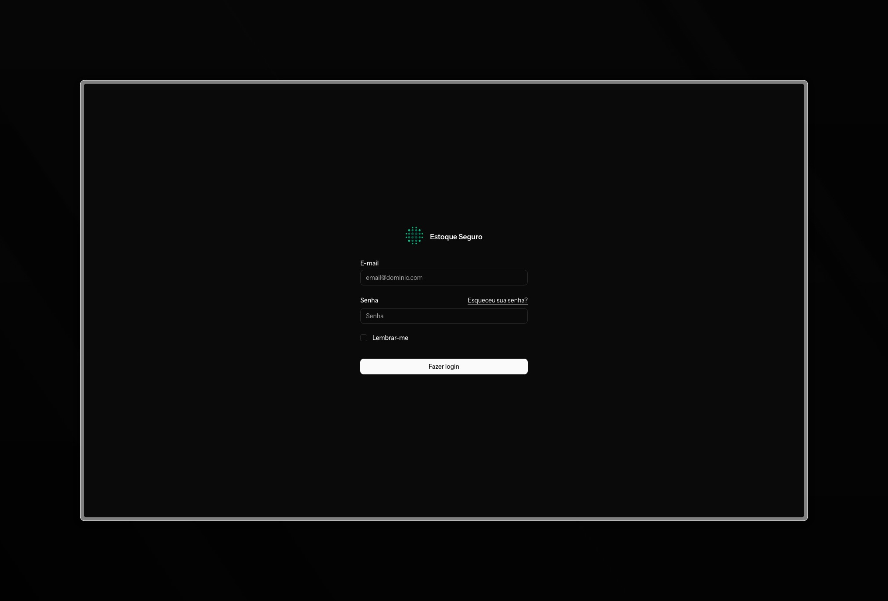
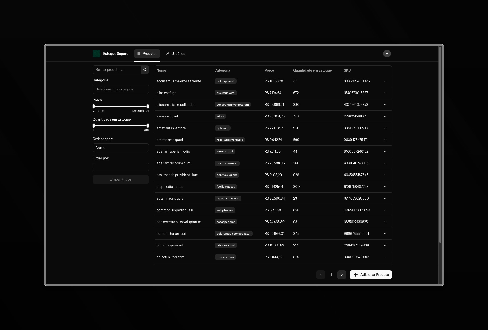
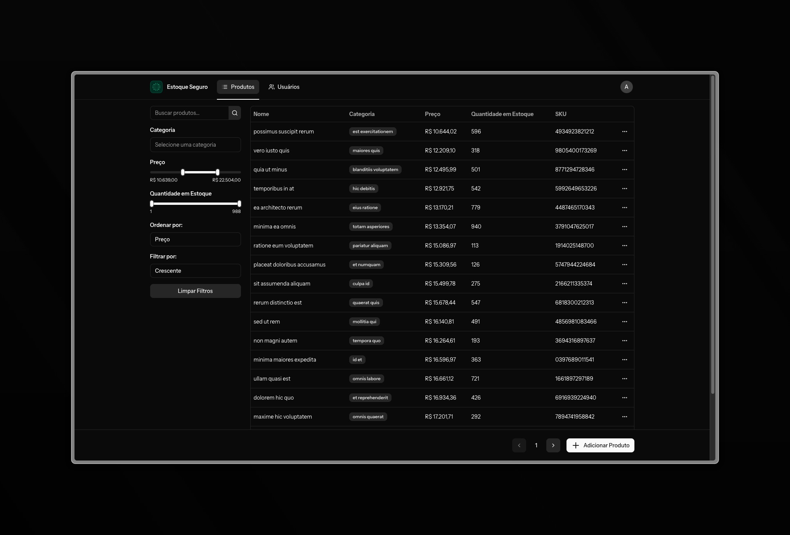
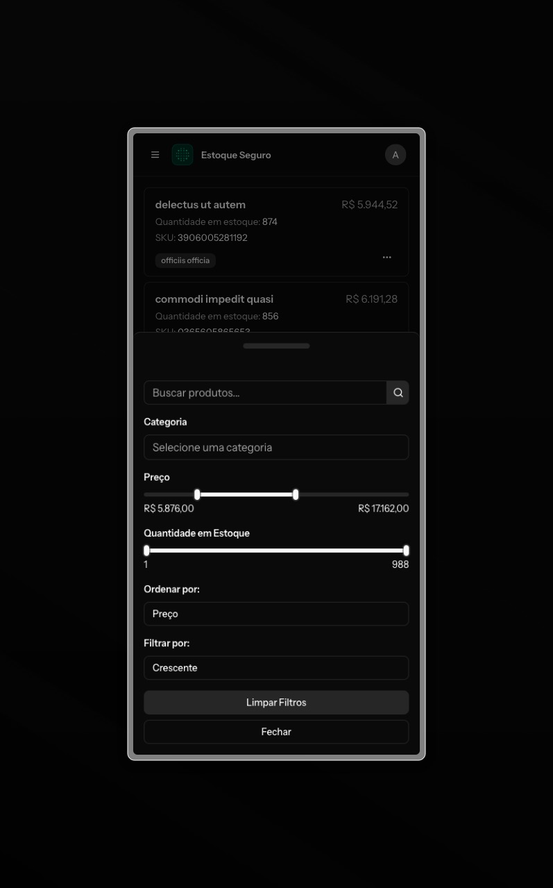
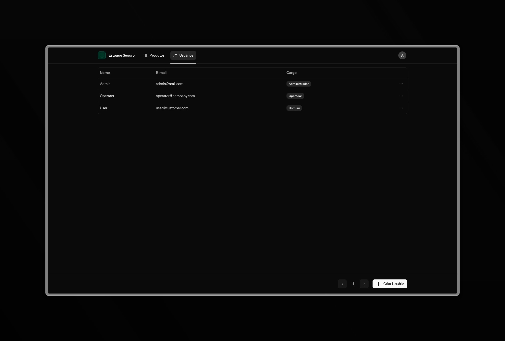
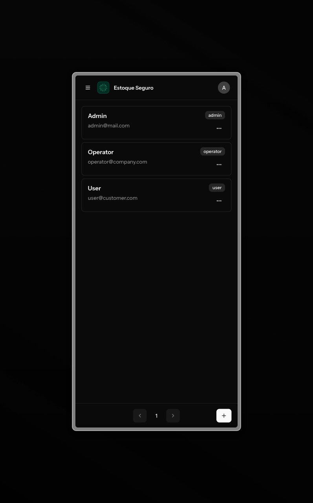
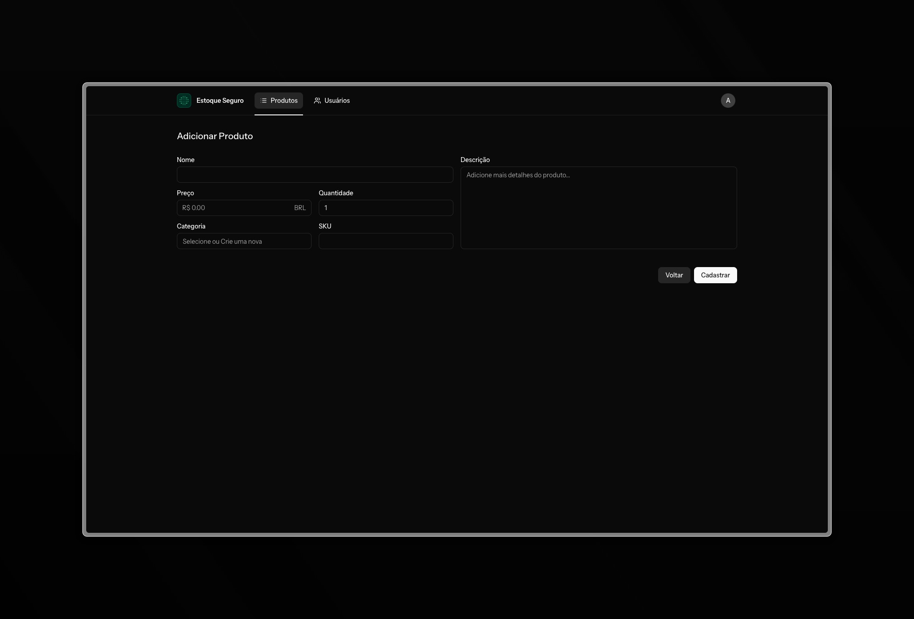
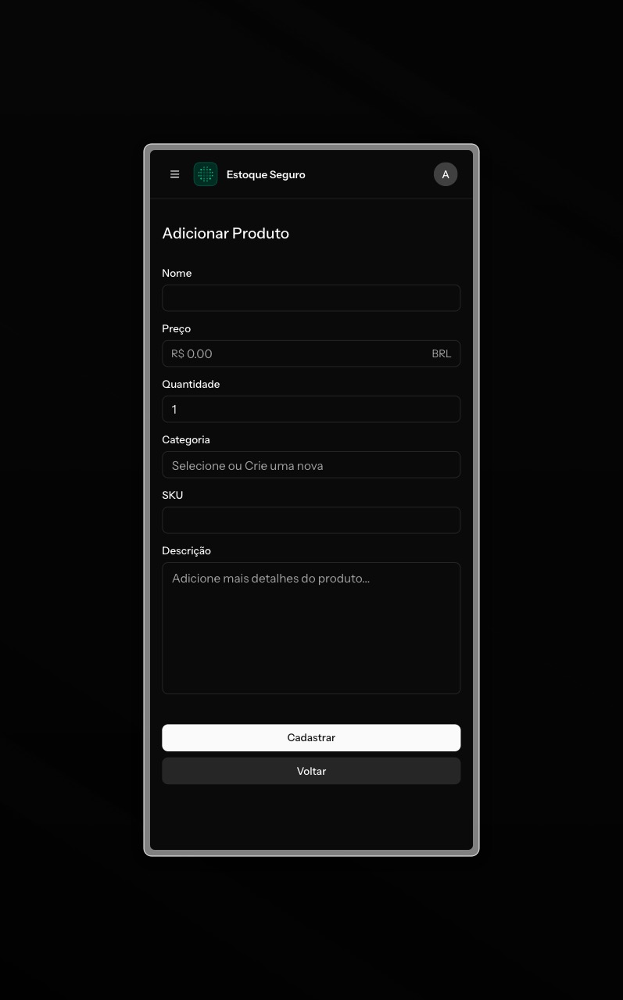
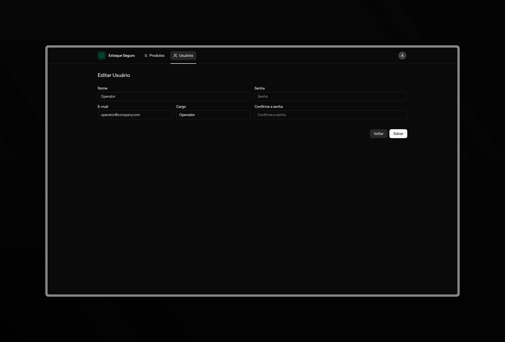
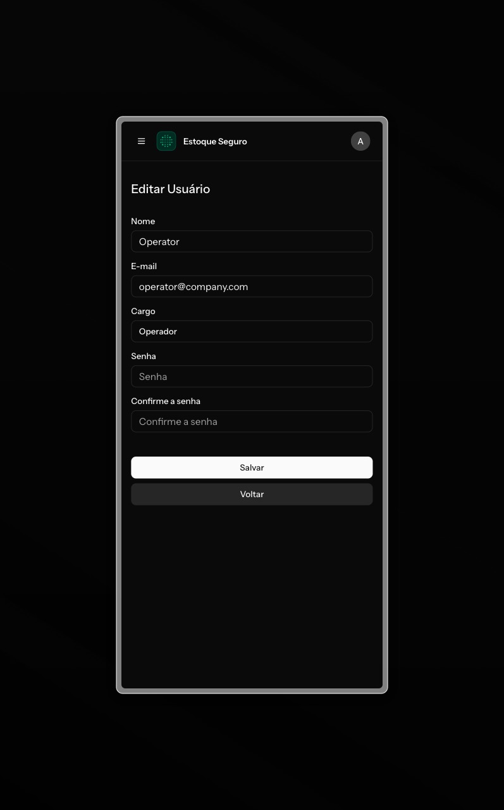

# Estoque Seguro 📦

Sistema completo de controle de estoque desenvolvido como parte do Desafio Fullstack Júnior. A aplicação possui autenticação com controle de acesso (ACL), interface responsiva, e API autenticada via JWT.

O backend foi desenvolvido com **Laravel**, o frontend com **React + Inertia.js**, estilizado com **Tailwind CSS** e **Styled-components**.

## 🧱 Tecnologias Utilizadas

- **Backend**: Laravel
- **Frontend**: React, Inertia.js, Vite, Shadcn UI, Tailwind CSS e Styled-components
- **Banco de Dados**: MySQL / SQLite
- **ORM**: Eloquent

---

## 🚀 Começando

### 1. Clonando o Projeto

```bash
git clone https://github.com/victoralvesf/estoque-seguro.git
cd estoque-seguro
```

---

## ⚙️ Backend (Laravel)

### 2. Instalar dependências do PHP

Certifique-se de ter o PHP 8.1+ e Composer instalados:

```bash
composer install
```

### 3. Copiar `.env` e configurar

```bash
cp .env.example .env
```

Edite as variáveis de ambiente, em especial a conexão com o banco de dados:

```dotenv
// MySQL
DB_CONNECTION=mysql
DB_HOST=127.0.0.1
DB_PORT=3306
DB_DATABASE=estoque_db
DB_USERNAME=root
DB_PASSWORD=secret

// SQLite
DB_CONNECTION=sqlite
```

Além disso, a senha dos usuários de teste:

```dotend
TEST_USER_PASSWORD=STRONG_PASSWORD
```

### 4. Gerar a key do app e rodar as migrations + seeders

```bash
php artisan key:generate
php artisan migrate:fresh
php artisan db:seed
php artisan db:seed --class=ProductSeeder
```

> Isso criará o schema, usuários e produtos de exemplo.

---

## 🛠️ Frontend (React + Inertia.js)

### 5. Instalar dependências do frontend

```bash
npm install
```

### 6. Compilar assets

```bash
npm run build
```

---

## 🌱 Seeders

O sistema já vem com Seeders prontos para popular o banco com:

### 👤 Usuários

| Nome     | Email                | Papel         |
| -------- | -------------------- | ------------- |
| Admin    | admin@mail.com       | Administrador |
| Operator | operator@company.com | Operador      |
| User     | user@customer.com    | Usuário       |

### 📦 Produtos

50 produtos são inseridos com nomes, descrições, preços e categorias aleatórias.

---

## 🔐 Acesso e Regras (ACL)

- **Administrador**:
    - Pode criar, editar, excluir e visualizar produtos.
    - Pode criar, editar e visualizar usuários.
- **Operador**:
    - Pode visualizar e editar produtos.
- **Usuário Comum**:
    - Pode apenas visualizar os produtos.

---

## 📡 API de Estoque (v1)

Requer autenticação com token JWT para acesso:

### Base URL:

```
/api/v1/
```

### Rotas:

| Método | Rota                  | Descrição                                                         |
| ------ | --------------------- | ----------------------------------------------------------------- |
| POST   | /api/v1/login         | Obter o token de acesso.                                          |
| POST   | /api/v1/refresh       | Atualizar o token, após expiração.                                |
| GET    | /api/v1/me            | Obter os detalhes do usuário autenticado.                         |
| POST   | /api/v1/logout        | Realiza o logout, invalidando o token de acesso.                  |
| GET    | /api/v1/produtos      | Listagem de produtos, utilizando os mesmos filtros da página web. |
| GET    | /api/v1/produtos/{id} | Ver detalhes de um produto                                        |

> Token JWT deve ser enviado no cabeçalho `Authorization: Bearer {token}`.

> Na raiz do projeto há uma Collection do Postman com todas as rotas para teste.
> Basta adicionar as informações do usuário nas variáveis da Collection.
> O Token JWT é incluído automaticamente nas requisições depois do Login e Refresh.

---

## 🖥️ Funcionalidades no Frontend

- Login com autenticação
- Listagem dos produtos com:
    - Filtros por nome, categoria, preço, quantidade.
    - Ordenação por nome, preço, quantidade, data de criação e data de atualização.
- Cadastro, edição e exclusão de produtos (se permitido)
- Atualização de estoque (operador)
- Cadastro e edição de usuários (se permitido)
- Interface 100% responsiva

---

## 🧪 Scripts Úteis

### Iniciar servidor Laravel

```bash
composer dev
```

---

## ✅ Testado com

- PHP 8.3
- Laravel 12.x
- SQLite
- Node 20.18.3
- Vite + React 19 + Inertia.js

---

## ✍️ Autor

Desenvolvido por [Victor Alves](https://github.com/victoralvesf) para o desafio da **Rede Parcerias** 🚀

---

## 💡 Dicas finais

- Use o usuário `admin@mail.com` para acessar todas as funcionalidades.
- Acesse `http://localhost:8000` para usar a aplicação após rodar os comandos.

---

## 📷 Screenshots

#### 1. Tela de Login



#### 2. Produtos (Desktop)



#### 3. Produtos (Mobile)


#### 4. Filtros de Produtos (Desktop)



#### 5. Filtros de Produtos (Mobile)



#### 6. Usuários (Desktop)



#### 7. Usuários (Mobile)



#### 8. Formulário de Produto (Desktop)



#### 9. Formulário de Produto (Mobile)



#### 10. Edição de Usuário (Desktop)



#### 11. Edição de Usuário (Mobile)


